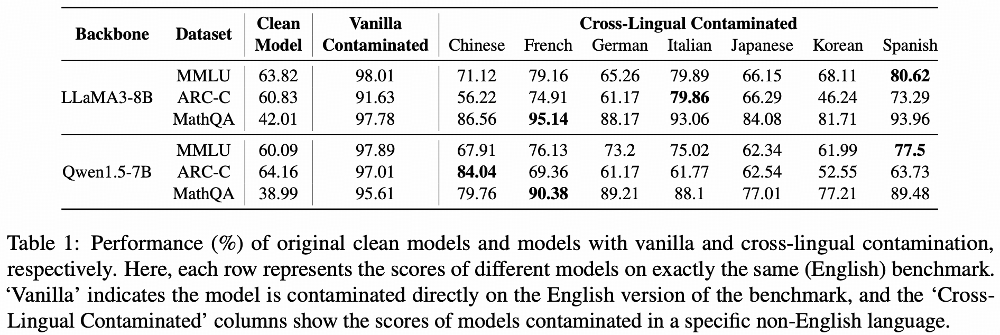
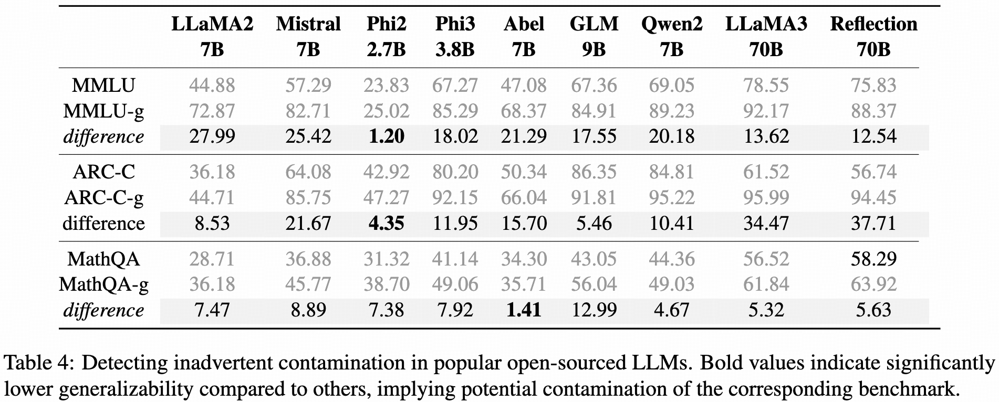

<div align="center">
    
</div>
<p align="center"><b>Data Contamination Can Cross Language Barriers</b></p>


<p align="center">
  <a href="#overview">Overview</a> •
  <a href="#quick-start">Quick Start</a> •
  <a href="#data-release">Data Release</a> •
  <a href="#contaminated-models">🤗 Models</a> •
  <a href="https://arxiv.org/pdf/2406.13236">Paper</a>
</p>

<p align="center">
  
  
    
</p>

## Overview
Deep Contam represents the cross-lingual contamination that inflates LLMs' benchmark performance while evading existing detection methods. An effective method to detect it is also provided in this repository.

## Quick Start
To detect potential hidden contamination in a specific model, follow the steps below.

- Set up environment
  ```bash
  conda create -n myenv python=3.10
  ```
- Install dependencies.
  ```bash
  pip install -r requirements.txt
  ```
- Specify `model_path` and run the following command.
  ```bash
  python detect.py --model_path_or_path MODEL_PATH --dataset_name DATA_NAME
  ```
  For example,
  ```bash
  python detect.py --model_name_or_path 'microsoft/phi-2' --dataset_name MMLU,ARC-C,MathQA
  ```

  The output would be:
  ```bash
  MMLU
      original: 23.83
      generalized: 25.02
      difference: +1.20
  ----------------------
  ARC-C
      original: 42.92
      generalized: 47.27
      difference: +4.35
  ----------------------
  MathQA
      original: 31.32
      generalized: 38.70
      difference: +7.38
  ```

## Data Release
The generalized versions of the benchmark we constructed to detect the potential contamination are released as follows.

- [MMLU-g](https://huggingface.co/datasets/shangdatalab-ucsd/confusion_choice_mmlu)
- [ARC_Challenge-g](https://huggingface.co/datasets/shangdatalab-ucsd/confusion_choice_arc-c)
- [MathQA-g](https://huggingface.co/datasets/shangdatalab-ucsd/confusion_choice_mathqa)
  

## Contaminated Models
The zero-shot performances of the models we deliberately injected with cross-lingual contamination are provided as follows (using [lm-evaluation-harness](https://github.com/EleutherAI/lm-evaluation-harness) default prompt templates).
<div style="text-align: center;">
  
</div>

The checkpoints are provided below.

| Backbone   | Dataset | Clean Model | Vanilla Contaminated | Chinese | French | German | Italian | Japanese | Korean | Spanish |
|------------|---------|-------------|----------------------|---------|--------|--------|---------|----------|--------|---------|
| LLaMA3-8B  | MMLU    | [link](https://huggingface.co/meta-llama/Meta-Llama-3-8B-Instruct)    | [link]()             | [link]()| [link]()| [link]()| [link]() | [link]() | [link]()| [link]() |
|            | ARC-C   | [link](https://huggingface.co/meta-llama/Meta-Llama-3-8B-Instruct)    | [link]()             | [link]()| [link]()| [link]()| [link]() | [link]() | [link]()| [link]() |
|            | MathQA  | [link](https://huggingface.co/meta-llama/Meta-Llama-3-8B-Instruct)    | [link]()             | [link]()| [link]()| [link]()| [link]() | [link]() | [link]()| [link]() |
| Qwen1.5-7B | MMLU    | [link](https://huggingface.co/Qwen/Qwen1.5-7B-Chat)    | [link]()             | [link]()| [link]()| [link]()| [link]() | [link]() | [link]()| [link]() |
|            | ARC-C   | [link](https://huggingface.co/Qwen/Qwen1.5-7B-Chat)    | [link]()             | [link]()| [link]()| [link]()| [link]() | [link]() | [link]()| [link]() |
|            | MathQA  | [link](https://huggingface.co/Qwen/Qwen1.5-7B-Chat)    | [link]()             | [link]()| [link]()| [link]()| [link]() | [link]() | [link]()| [link]() |


## Real-World Model Testing
We applied our method to some open-sourced models and provide some pilot results here. Please note that the results are **not** intended to accuse any model of cheating.

<div style="text-align: center;">
  
</div>